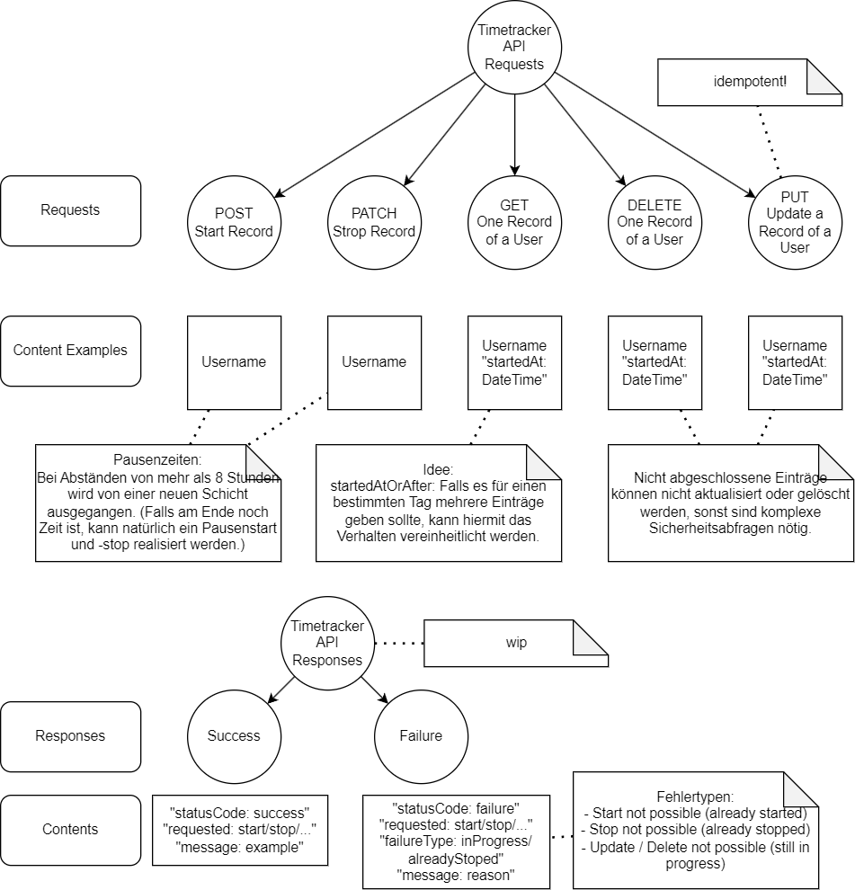
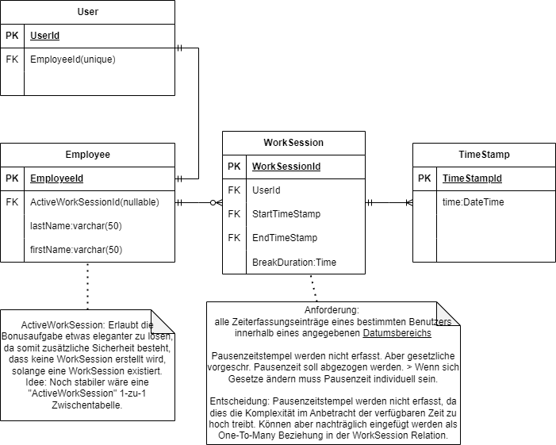
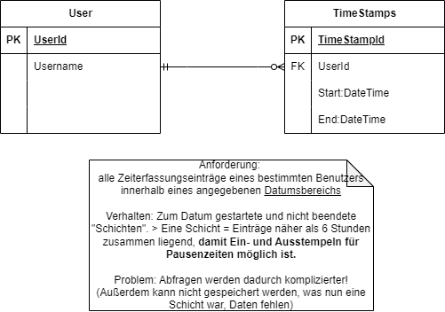

# Timetracker

*Referenz: https://stackoverflow.blog/2020/03/02/best-practices-for-rest-api-design/*

## Testdaten

user=DemoUser

## offene Frage

Sollte der Benutzer sich einloggen, und ist es ergo nicht nötig eine WorkSession per Pfad (/users/:name) anzusteuern?

## API-Modell URLs

**ZonedDateTime** ```Format: YYYY-MM-DDTHH:MM:SS[-+]HH Example: 2024-12-24T13:00:05+01```

### Eine Zeiterfassung starten
- POST timetracker.de/users/:name/worksessions/
- gibt die ```sessionId``` zurück der erstellten WorkSession
- führt zu einer Fehlermeldung, falls eine vorherige WorkSession noch nicht beendet wurde

### Einen aktiven Zeiterfassungseintrag stoppen - WIP
- PATCH timetracker.de/users/:name/worksessions/:sessionId
- PATCH timetracker.de/users/:name/worksessions/?firstEntryAfter=:ZonedDateTime
- nicht existierende oder bereits beendete WorkSessions führen zu einer Fehlermeldung
- POST timetracker.de/users/:name/worksessions/:sessionId/status_changes - payload: {status:finished}

#### Problemstellung

1. Komplexe Aktionen erfordern ein Verb, dass nicht den üblichen HTML-Operationen (GET, POST, PUT, DEL) entspricht.
2. Was nutze ich, sobald es für eine Ressource zwei Operationen gibt? Z.B. "Zeit stoppen" und "Zeit pausieren".
3. Ausführliche Recherche führt zu keinen logisch begründeten Vorgehen, die Argumente sind immer fadenscheinig warum ein Verb nicht im Pfad verwendet werden sollte. Es gibt keine guten REST-API Beispiele, die weithin als gut Referenz angesehen wird.
> "Avoid verbs in URLs" wird nur begründet mit "a resource must be identifiable by an URL". Hier gibt es aber nie Referenzen, und eine URL kann ja immer nur auf eine Ressource zeigen, aber umgedreht darf es natürlich URLs geben, die keiner Resource entsprechen.

#### Lösungsansatz: benutzerfreundlich

- Eine Aktion für eine Resource ist immer dann mit einem Verb am Ende der URL zu versehen, falls es keine Standard HTML-Operation gibt.
- Standard-HTML-Operationen sind ausschließlich GET POST PUT DELETE, und ausnahmsweise PATCH.
  - Sogar PATCH hat noch nicht den Status "APPROVED" in der RFC erhalten, sondern schwimmt seit 15  (!) Jahren als PROPOSED (https://datatracker.ietf.org/doc/html/rfc5789).
- Beispiel: PATCH timetracker.de/users/:name/worksessions/:sessionId/finish
- Andere HTML-Operationen (es gibt ca. 20, z.B. LOCK und UNLOCK) sollten nicht verwendet werden, da oft Firewalls diese Operationen limittieren,
 und auch nicht alle Frameworks und Bibliotheken diese unterstützen.
- Ausgeschlossen wird "PUT complete_resource" um die komplette Ressource mit einem beendet Zeitstempel zu aktualisieren. Hier hätte der Server zu viele Updates im Backend zu validieren!
- Die letzte Möglichkeit ist den Status als Sub-Ressource zu offerieren...aber erneut haben komplexere Geschäftslogiken auch mehr Verben. Außerdem müsste dann der Client die Stati kennen, und hätte auch nicht die Möglichkeit **anhand der URLS** alle Manipulationsmöglichkeiten der Ressource zu erkunden. Er müsste dann erst mal JSONs auswerten. Und dies ist zur Abbildung einer State-Machine viel zu kompliziert.
  - Beispiel: PUT timetracker.de/users/:name/worksessions/:sessionId/status {finished:true} 
  - --> Was ist wenn wir mehrere Wahrheitswerte haben? z.B. not_started -> in_progress -> paused -> in_progress -> finished 
  - Ich finde diese Art von Manipulation nur schwer übertragbar in ein Link-Schema. z.B. ```"rel:pause", "link:/status/", "method:PUT", "in_progress:false", "paused:true", "finished:false"```

#### Lösungsansatz: REST-API getreut

*Roy Fieldings Disseration on REST:*

>  The central feature that distinguishes the REST architectural style from other network-
based styles is its emphasis on a uniform interface between components (Figure 5-6). By
applying the software engineering principle of generality to the component interface, the
overall system architecture is simplified and the visibility of interactions is improved. (...) The trade-off, though, is that a uniform interface degrades
efficiency, since information is transferred in a standardized form rather than one which is
specific to an application’s needs. In order to obtain a uniform interface, multiple architectural constraints are needed to
guide the behavior of components (...one of them being) manipulation of resources through representations. (...) 


> The key abstraction of information in REST is a resource. Any information that can be
named can be a resource: a document or image, a temporal service (e.g. “today’s weather
in Los Angeles”), a collection of other resources, a non-virtual object (e.g. a person), and
so on. In other words, any concept that might be the target of an author’s hypertext
reference must fit within the definition of a resource. A resource is a conceptual mapping
to a set of entities, not the entity that corresponds to the mapping at any particular point in
time.(...)
REST uses a resource identifier to identify the particular resource involved in an
interaction between components. REST connectors provide a generic interface for
accessing and manipulating the value set of a resource, regardless of how the membership
function is defined or the type of software that is handling the request. (...)
REST components perform actions on a resource **by using a representation to capture the
current or intended state of that resource and transferring that representation between
components.** A representation is a sequence of bytes, plus representation metadata to
describe those bytes.

- Die Ressourcen müssen in der Art aufgeteilt werden, dass man die Ressource "Ende einer Zeitmessung" per POST erstellen kann, ohne eine Uhrzeit übertragen zu müssen (sonst könnte es zu Zeitzonenproblemen kommen).
- Entweder gibt es Ausstempel-Einträge, oder es gibt Status-Änderungen. Alternativ gibt lediglich "Stempel-Einträge", die Server-Logik entscheidet dann, ob es ein Aus- oder Einstempeln ist.
  - Das Ziel ist, dass der Client nicht immerzu neue Verben (dh. Endpunkte) lernen muss, sondern bestehende Ressourcen anders manipulieren kann, falls sich etwas ändert.
  - Dementsprechend ist die Subressource /status-changes am geeignetsten. Dann kann in Zukunft auch eine manuelle Pause und mehrere Pausen als Feature hinzugefügt werden.
  - Oder /worksessions/:id/timestamps - hier wäre ausgeschlossen, dass ein Verwechlungs mit anderen Statusarten wie "locked" oder ähnliches vorkommt.
  - intuitiver finde ich /worksessions/:id/start-timestamp und /worksessions/:id/end-timestamp
  - worksessions/:id/status-changes ist aber wesentlich skalierbarer, insofern es irgendwann manuelle Pausen geben sollte
  - Da die Pausen berechnet werden müssen, ist immer die Ressource "worksession" Pflicht, es gibt keine sinnvolle Möglichkeit ohne eine klare Definition der Arbeitsschicht die Pausenzeit zu berechnen.
- Entscheidung: ```POST /users/:name/worksessions/:id/end-timestamp``` lößt das Problem, aber GET&PUT für start-timestamp und end-timestamp sollten der Uniformität halber implementiert werden.
- Falls Pausenzeiten manuell eingepflegbar werden sollten, ist die Subressource /breakstimestamps möglich

### Einen spezifischen Zeiterfassungseintrag auslesen
- GET timetracker.de/users/:name/worksessions/:sessionId
- GET timetracker.de/users/:name/worksessions/?firstEntryAfter=:ZonedDateTime
- nicht existierende WorkSessions führen zu einer Fehlermeldung

### Einen spezifischen Zeiterfassungseintrag aktualisieren oder löschen
- PUT/DELETE timetracker.de/users/:name/worksessions/:sessionId
- PUT/DELETE timetracker.de/users/:name/worksessions/?firstEntryAfter=:ZonedDateTime
- nicht existierende WorkSessions führen zu einer Fehlermeldung
- offen: nicht beendete WorkSessions führen zu einer Fehlermeldung bei Aktualisierung/Löschung?

### Langfristige Überlegungen zu Abfragen von Sets
- Einzelne Sessions sollte nicht mittels ```GET timetracker.de/users/:name/worksessions/:year/:month/:day/:hour/:minute``` gesucht werden
  - Grund: Was ist, wenn es mehrere Sessions an einem Tag gibt? Außerdem führt es zu einem tiefen Nesting.
- Mehrere Sessions sollten per Filter-Queries gesucht werden: ```GET timetracker.de/users/:name/worksessions&year=:year&month=:month```

## API-Modell Diagramm



## ERD



## Erster Entwurf Datenmodell


