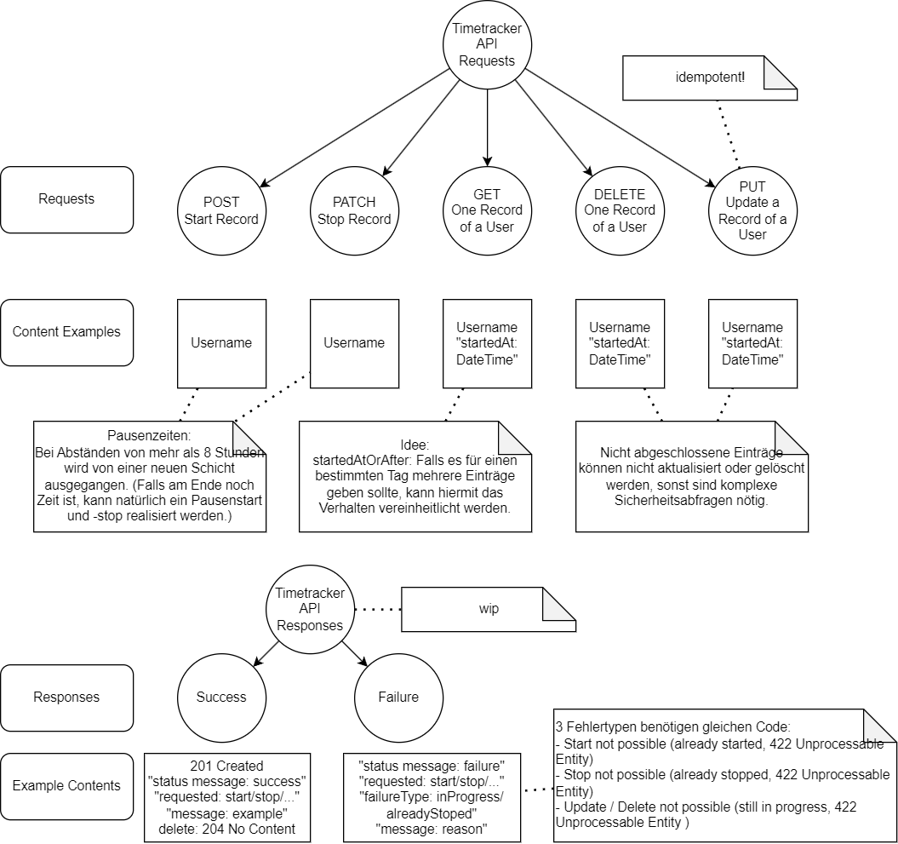
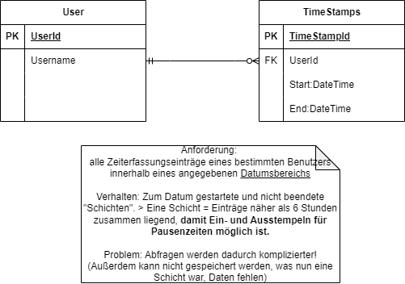

# Timetracker

*Referenz: https://stackoverflow.blog/2020/03/02/best-practices-for-rest-api-design/*

## offene Frage

Sollte der Benutzer sich einloggen, und ist es ergo nicht nötig eine WorkSession per Pfad (/employees/:name) anzusteuern?

## API-Modell URLs

**ZonedDateTime** ```Format: YYYY-MM-DDTHH:MM:SS[-+]HH Example: 2024-12-24T13:00:05+01```

### Eine Zeiterfassung starten
- POST timetracker.de/employees/:name/worksessions/
- gibt die ```sessionId``` zurück der erstellten WorkSession
- führt zu einer Fehlermeldung, falls eine vorherige WorkSession noch nicht beendet wurde

### Einen aktiven Zeiterfassungseintrag stoppen
- PATCH timetracker.de/employees/:name/worksessions/:sessionId
- PATCH timetracker.de/employees/:name/worksessions/?firstEntryAfter=:ZonedDateTime
- nicht existierende oder bereits beendete WorkSessions führen zu einer Fehlermeldung

### Einen spezifischen Zeiterfassungseintrag auslesen
- GET timetracker.de/employees/:name/worksessions/:sessionId
- GET timetracker.de/employees/:name/worksessions/?firstEntryAfter=:ZonedDateTime
- nicht existierende WorkSessions führen zu einer Fehlermeldung

### Einen spezifischen Zeiterfassungseintrag aktualisieren oder löschen
- PUT/DELETE timetracker.de/employees/:name/worksessions/:sessionId
- PUT/DELETE timetracker.de/employees/:name/worksessions/?firstEntryAfter=:ZonedDateTime
- nicht existierende WorkSessions führen zu einer Fehlermeldung
- offen: nicht beendete WorkSessions führen zu einer Fehlermeldung bei Aktualisierung/Löschung?

### Langfristige Überlegungen zu Abfragen von Sets
- Einzelne Sessions sollte nicht mittels ```GET timetracker.de/employees/:name/worksessions/:year/:month/:day/:hour/:minute``` gesucht werden
  - Grund: Was ist, wenn es mehrere Sessions an einem Tag gibt? Außerdem führt es zu einem tiefen Nesting.
- Mehrere Sessions sollten per Filter-Queries gesucht werden: ```GET timetracker.de/employees/:name/worksessions&year=:year&month=:month```

## API-Modell Diagramm



## ERD


## Erster Entwurf Datenmodell


